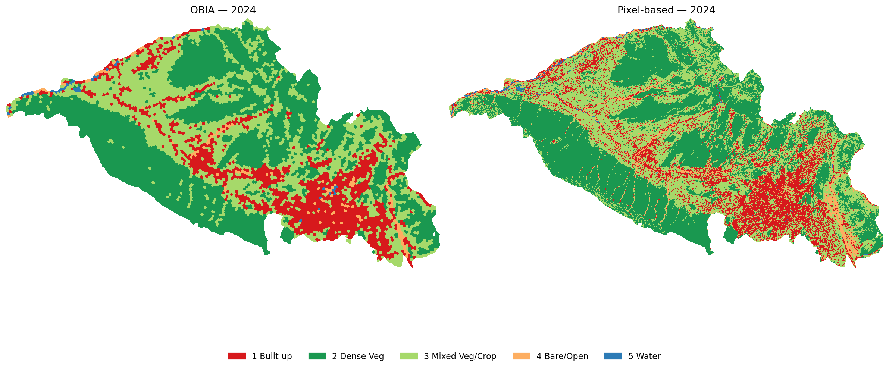
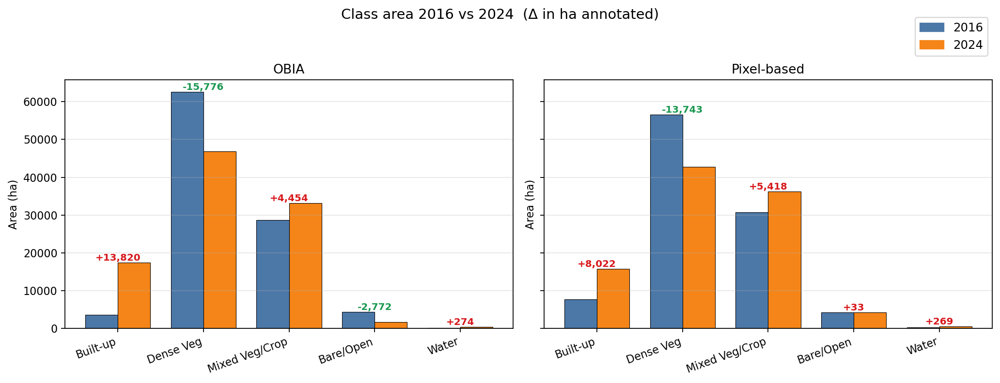
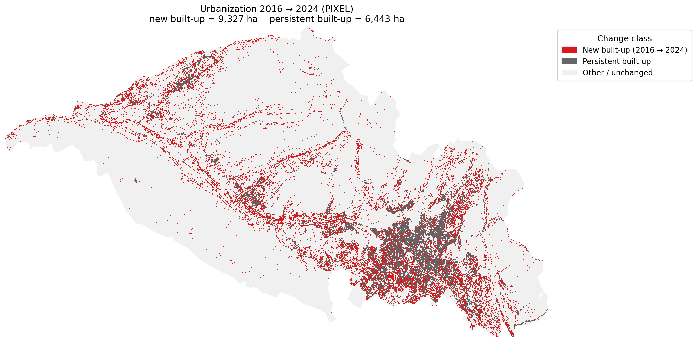
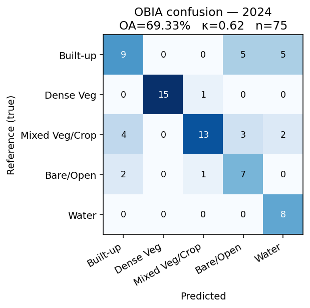
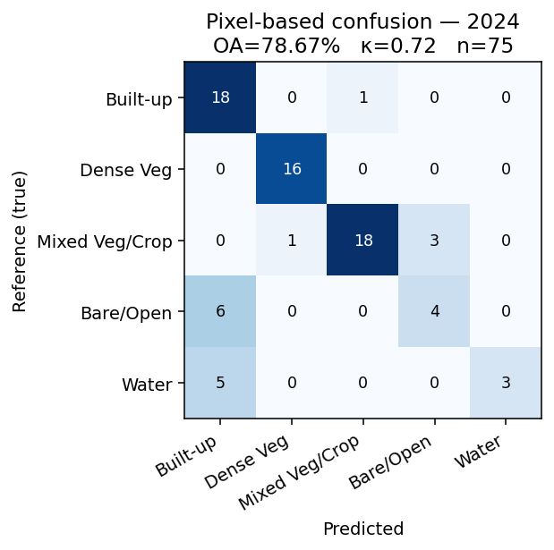
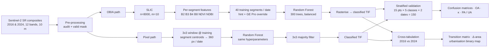

# OBIA vs Pixel-Based Classification — Sentinel-2 over Dehradun (2016 → 2024)

> A reproducible comparative study of **Object-Based Image Analysis (OBIA)** versus **per-pixel Random Forest** for mapping urban expansion in the Dehradun Valley, India, using cloud-free Sentinel-2 winter composites for 2016 and 2024.


**Author:** Mohammad Salman · M.Sc. Geo-informatics · [IIRS, ISRO Dehradun](https://www.iirs.gov.in/)
**Year:** 2026 · **AOI:** Dehradun Valley, Uttarakhand (~996 km² valid land at 10 m)

---

## TL;DR

| Headline | Number |
|---|---|
| Pixel-based RF overall accuracy (both dates) | **78.7 %**, κ = **0.72** |
| OBIA RF overall accuracy | 65.3 % (2016) · 69.3 % (2024), κ = 0.57 / 0.62 |
| New built-up area 2016 → 2024 (preferred, pixel-based) | **≈ 80 km²** |
| Dense vegetation lost 2016 → 2024 | ≈ 137 km² (pixel) · 158 km² (OBIA) |
| Reference points used for validation | 150 (75 / date, stratified random) |

**Key finding.** At the SLIC scale tested (median segment ≈ 12.4 ha), per-pixel Random Forest with a 3×3 majority filter **outperforms** OBIA on Sentinel-2, even though OBIA produces visually smoother maps. The accuracy gap is consistent across both 2016 and 2024.

---

## Table of contents

- [Why this study](#why-this-study)
- [Results gallery](#results-gallery)
- [Pipeline](#pipeline)
- [Repository layout](#repository-layout)
- [Reproduce it](#reproduce-it)
- [Accuracy details](#accuracy-details)
- [Change detection numbers](#change-detection-numbers)
- [Caveats](#caveats)
- [Citation](#citation)
- [References](#references)
- [License](#license)

---

## Why this study

Dehradun is one of India's fastest-growing tier-II cities, sitting in a structural valley between the Mussoorie ridge and the Shivalik foothills. Tracking its urban expansion at 10 m resolution requires choosing a classification paradigm:

- **Pixel-based** — fast, captures fine spectral detail, but introduces salt-and-pepper noise.
- **OBIA** — groups pixels into image objects first, produces visually smoother output, but the choice of segmentation scale dominates the result.

Existing comparative literature is split: OBIA tends to win on very-high-resolution imagery ([Hossain & Chen, 2019](#references)), but the advantage diminishes — and may reverse — as pixel size approaches the characteristic size of land-cover objects ([Ma et al., 2017](#references)).

**Research question.** Does OBIA on Sentinel-2 produce a more accurate land-cover map of Dehradun than per-pixel Random Forest, and how much new built-up area appeared 2016 → 2024?

---

## Results gallery

### Classified maps — 2024 (OBIA vs Pixel-based, side-by-side)



OBIA (left) covers the central built-up cluster as one contiguous patch; pixel-based (right) preserves internal vegetation pockets (parks, riverine corridors, institutional campuses).

### Class area, 2016 vs 2024



Both methods agree on direction for every class. OBIA estimates a larger built-up expansion (+138 km²) than pixel-based (+80 km²); the latter is the more accurate classifier (see [Accuracy details](#accuracy-details)) and is the preferred figure.

### Urban expansion 2016 → 2024 (pixel-based)



Red = new built-up between 2016 and 2024. Grey = persistent built-up. Most expansion occurs along the IT corridor (Selaqui, Sahastradhara) and on the valley floor between Dehradun and Doiwala.

### Confusion matrices — 2024

| OBIA | Pixel-based |
|:---:|:---:|
|  |  |

---

## Pipeline



**Same training data, same features, same RF hyperparameters — only the spatial unit of classification differs.** This is the critical design choice that makes the OBIA-vs-pixel comparison clean.

---

## Repository layout

```
.
├── 01_raw_data/                  # Sentinel-2 composites (LARGE, gitignored)
│   └── Dehradun_S2_scene_metadata.csv
├── 02_preprocessing/             # AOI valid masks, inspection logs
├── 03_segmentation/              # SLIC label rasters per date
├── 04_classification_OBIA/       # segment features, training tables, OBIA classified TIFs
├── 05_classification_pixel/      # pixel classified TIFs (raw + 3x3-filtered)
├── 06_validation/                # KML reference points, accuracy_summary.csv, confusion matrices
├── 07_change_detection/          # transition matrices, urbanisation binary, change-class raster
├── 08_maps_final/                # PNG cartographic output for the deck/report
├── 09_report_slides/             # PowerPoint deck + Word report
├── scripts/                      # 01-14, numbered, runnable in order
│   ├── 01_inspect_rasters.py
│   ├── 02_build_valid_mask.py
│   ├── 03_slic_segmentation.py
│   ├── 04_segment_features.py
│   ├── 05_training_candidates.py
│   ├── 05b_training_kml.py
│   ├── 06_parse_training_labels.py
│   ├── 06b_apply_corrections.py
│   ├── 07_obia_train_classify.py
│   ├── 08_pixel_train_classify.py
│   ├── 09_validation_kml.py
│   ├── 10_confusion.py
│   ├── 11_change_detection.py
│   ├── 12_maps.py
│   ├── 13_slides.py
│   └── 14_report.py
├── requirements.txt
├── LICENSE
└── README.md
```

---

## Reproduce it

### 1. Get the source rasters

The 1.2 GB Sentinel-2 composites are excluded from the repo. Regenerate them in [Google Earth Engine](https://earthengine.google.com/) with the AOI vector and the date windows below, then drop them into `01_raw_data/`:

| File | Window | Bands |
|---|---|---|
| `Dehradun_2016.tif` | 2016-11-01 → 2017-02-28 | B2 B3 B4 B8 B5 B6 B7 B8A B11 B12 NDVI NDBI |
| `Dehradun_2024.tif` | 2024-11-01 → 2025-02-28 | (same) |

Both should be Float32, EPSG:32644, 10 m, clipped to the same AOI.

### 2. Install Python dependencies

```bash
python -m pip install -r requirements.txt
```

### 3. Run the pipeline

```bash
# OBIA + pixel pipelines + maps + slides + report — full chain
python scripts/01_inspect_rasters.py
python scripts/02_build_valid_mask.py
python scripts/03_slic_segmentation.py
python scripts/04_segment_features.py
python scripts/05_training_candidates.py
python scripts/05b_training_kml.py
# --- pause: label training segments in Google Earth Pro ---
python scripts/06b_apply_corrections.py        # edit the CORRECTIONS dict first
python scripts/07_obia_train_classify.py
python scripts/08_pixel_train_classify.py
python scripts/09_validation_kml.py
# --- pause: label 150 validation points in Google Earth Pro ---
python scripts/10_confusion.py
python scripts/11_change_detection.py
python scripts/12_maps.py
python scripts/13_slides.py
python scripts/14_report.py
```

Random seeds (NumPy `42` and `2026`) are fixed throughout, so the candidate selection and validation sample are deterministic.

---

## Accuracy details

Computed from `06_validation/accuracy_summary.csv`. Reference n = 75 points / date / method.

| Method | Year | OA | κ | n |
|---|---|---|---|---|
| **OBIA** | 2016 | 65.3 % | 0.57 | 75 |
| **Pixel-based** | 2016 | **78.7 %** | **0.72** | 75 |
| **OBIA** | 2024 | 69.3 % | 0.62 | 75 |
| **Pixel-based** | 2024 | **78.7 %** | **0.72** | 75 |

**The pixel-based method beats OBIA by 9–13 percentage points OA and 0.10–0.15 κ on both dates.**

Why? Three reasons (see [`scripts/13_slides.py`](scripts/13_slides.py) slide 21 for the full discussion):

1. SLIC segments at our scale have a median of ≈ 12.4 ha. The characteristic length scale of land-cover change in peri-urban Dehradun is 0.1 – 1 ha. Mixed segments lose the minority class to within-segment averaging.
2. The 3×3 training window gives the pixel classifier ~360 training samples vs 40 segments for OBIA — a 9× richer training set.
3. Salt-and-pepper noise (the main critique of pixel-based) is largely cured by a single 3×3 majority filter without sacrificing boundary fidelity ([Lu & Weng, 2007](#references)).

---

## Change detection numbers

Computed from `07_change_detection/area_table_*.csv`.

| Class | OBIA 2016 (ha) | OBIA 2024 (ha) | Δ OBIA | Pixel 2016 (ha) | Pixel 2024 (ha) | Δ Pixel |
|---|---|---|---|---|---|---|
| Built-up | 3 607 | 17 427 | **+13 820** | 7 748 | 15 770 | **+8 022** |
| Dense Veg | 62 596 | 46 820 | −15 776 | 56 539 | 42 796 | −13 743 |
| Mixed Veg / Crop | 28 752 | 33 207 | +4 454 | 30 761 | 36 179 | +5 418 |
| Bare / Open | 4 449 | 1 677 | −2 772 | 4 235 | 4 268 | +33 |
| Water | 212 | 486 | +274 | 335 | 604 | +269 |

The **pixel-based figure (~80 km² of new built-up land)** is preferred because that method has higher validated accuracy.

---

## Caveats

- **Source data quality.** Bands B5/B6/B7/B8A/B11/B12 in both composites have effectively zero variance inside the AOI (likely a GEE export-side band reduction artefact). Feature set was restricted to B2/B3/B4/B8/NDVI/NDBI (six features instead of the originally planned seven). See `02_preprocessing/inside_aoi_stats.txt`.
- **Single segmentation scale.** Only `n_segments = 8000` was tested. Future work: sweep n ∈ {2k, 8k, 30k, 80k} and test multi-scale OBIA.
- **Sample size.** 75 reference points / date implies per-class 95 % CI of roughly ± 12 pp.
- **Single interpreter.** No inter-rater reliability quantified. All limitations apply equally to both methods, so the comparison itself remains fair.

---

## Citation

If this work is useful to you, please cite as:

> Salman, M. (2026). *Object-Based vs Pixel-Based Classification for Dehradun Urban Expansion Mapping (2016–2024)* [Computer software / mini-project report]. Indian Institute of Remote Sensing, ISRO. https://github.com/msiirs2025/obia-vs-pixel-sentinel2

BibTeX:

```bibtex
@misc{salman2026obia,
  author       = {Salman, Mohammad},
  title        = {Object-Based vs Pixel-Based Classification for Dehradun Urban Expansion Mapping (2016--2024)},
  year         = {2026},
  howpublished = {\url{https://github.com/msiirs2025/obia-vs-pixel-sentinel2}},
  note         = {M.Sc. Geo-informatics mini-project, Indian Institute of Remote Sensing}
}
```

---

## References

All in-text references in the [report](09_report_slides/Dehradun_OBIA_Report.docx) use APA 7. The full list of 14 sources is in Section 7 of the report; the load-bearing six are listed here for quick reference:

- Achanta, R., Shaji, A., Smith, K., Lucchi, A., Fua, P., & Süsstrunk, S. (2012). SLIC superpixels compared to state-of-the-art superpixel methods. *IEEE Transactions on Pattern Analysis and Machine Intelligence, 34*(11), 2274–2282. https://doi.org/10.1109/TPAMI.2012.120
- Blaschke, T. (2010). Object based image analysis for remote sensing. *ISPRS Journal of Photogrammetry and Remote Sensing, 65*(1), 2–16. https://doi.org/10.1016/j.isprsjprs.2009.06.004
- Breiman, L. (2001). Random forests. *Machine Learning, 45*(1), 5–32. https://doi.org/10.1023/A:1010933404324
- Hossain, M. D., & Chen, D. (2019). Segmentation for Object-Based Image Analysis (OBIA): A review of algorithms and challenges from remote sensing perspective. *ISPRS Journal of Photogrammetry and Remote Sensing, 150*, 115–134. https://doi.org/10.1016/j.isprsjprs.2019.02.009
- Lu, D., & Weng, Q. (2007). A survey of image classification methods and techniques for improving classification performance. *International Journal of Remote Sensing, 28*(5), 823–870. https://doi.org/10.1080/01431160600746456
- Ma, L., Li, M., Ma, X., Cheng, L., Du, P., & Liu, Y. (2017). A review of supervised object-based land-cover image classification. *ISPRS Journal of Photogrammetry and Remote Sensing, 130*, 277–293. https://doi.org/10.1016/j.isprsjprs.2017.06.001

---

## License

[MIT](LICENSE). © 2026 Mohammad Salman.

---

<sub>Acknowledgements: ESA Copernicus programme (Sentinel-2 imagery), Google Earth Engine team (composite generation platform), and the faculty of the Geo-informatics Department at IIRS Dehradun.</sub>
